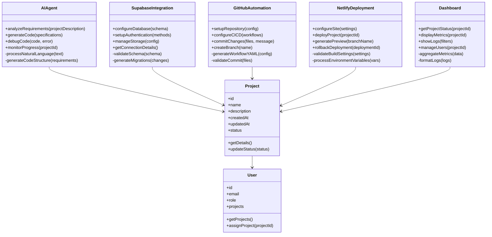

```mermaid
classDiagram
    class AIAgent {
        +analyzeRequirements(projectDescription)
        +generateCode(specifications)
        +debugCode(code, error)
        +monitorProgress(projectId)
        -processNaturalLanguage(text)
        -generateCodeStructure(requirements)
    }
    
    class SupabaseIntegration {
        +configureDatabase(schema)
        +setupAuthentication(methods)
        +manageStorage(config)
        +getConnectionDetails()
        -validateSchema(schema)
        -generateMigrations(changes)
    }
    
    class GitHubAutomation {
        +setupRepository(config)
        +configureCICD(workflows)
        +commitChanges(files, message)
        +createBranch(name)
        -generateWorkflowYAML(config)
        -validateCommit(files)
    }
    
    class NetlifyDeployment {
        +configureSite(settings)
        +deployProject(projectId)
        +generatePreview(branchName)
        +rollbackDeployment(deploymentId)
        -validateBuildSettings(settings)
        -processEnvironmentVariables(vars)
    }
    
    class Dashboard {
        +getProjectStatus(projectId)
        +displayMetrics(projectId)
        +showLogs(filters)
        +manageUsers(projectId)
        -aggregateMetrics(data)
        -formatLogs(logs)
    }
    
    class Project {
        +id
        +name
        +description
        +createdAt
        +updatedAt
        +status
        +getDetails()
        +updateStatus(status)
    }
    
    class User {
        +id
        +email
        +role
        +projects
        +getProjects()
        +assignProject(projectId)
    }
    
    AIAgent --> Project
    SupabaseIntegration --> Project
    GitHubAutomation --> Project
    NetlifyDeployment --> Project
    Dashboard --> Project
    Project --> User
```
