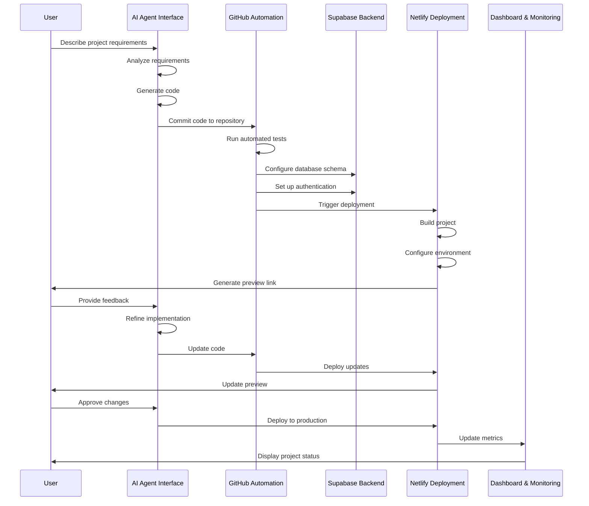

```mermaid
sequenceDiagram
    participant User
    participant AI as AI Agent Interface
    participant GitHub as GitHub Automation
    participant Supabase as Supabase Backend
    participant Netlify as Netlify Deployment
    participant Dashboard as Dashboard & Monitoring

    User->>AI: Describe project requirements
    AI->>AI: Analyze requirements
    AI->>AI: Generate code
    AI->>GitHub: Commit code to repository
    GitHub->>GitHub: Run automated tests
    GitHub->>Supabase: Configure database schema
    GitHub->>Supabase: Set up authentication
    GitHub->>Netlify: Trigger deployment
    Netlify->>Netlify: Build project
    Netlify->>Netlify: Configure environment
    Netlify->>User: Generate preview link
    User->>AI: Provide feedback
    AI->>AI: Refine implementation
    AI->>GitHub: Update code
    GitHub->>Netlify: Deploy updates
    Netlify->>User: Update preview
    User->>AI: Approve changes
    AI->>Netlify: Deploy to production
    Netlify->>Dashboard: Update metrics
    Dashboard->>User: Display project status
```
