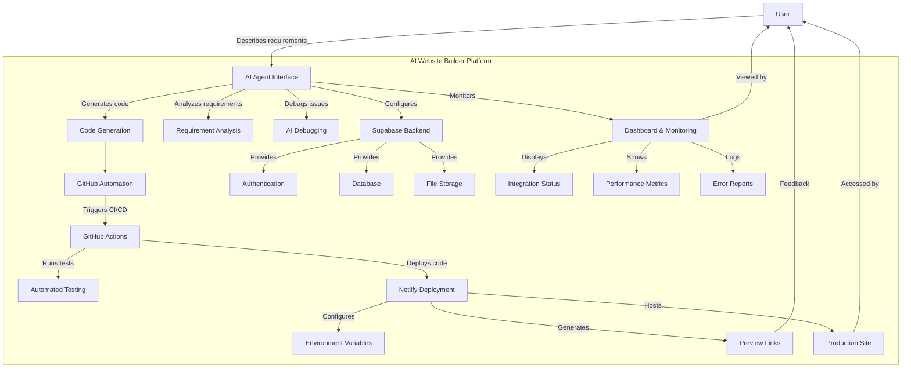

```mermaid
graph TD
    User[User] --> |Describes requirements| AI[AI Agent Interface]
    
    subgraph "AI Website Builder Platform"
        AI --> |Generates code| Code[Code Generation]
        AI --> |Analyzes requirements| Analysis[Requirement Analysis]
        AI --> |Debugs issues| Debug[AI Debugging]
        
        Code --> GitHub[GitHub Automation]
        GitHub --> |Triggers CI/CD| Actions[GitHub Actions]
        Actions --> |Runs tests| Testing[Automated Testing]
        Actions --> |Deploys code| Netlify[Netlify Deployment]
        
        Netlify --> |Configures| Env[Environment Variables]
        Netlify --> |Generates| Preview[Preview Links]
        Netlify --> |Hosts| Production[Production Site]
        
        AI --> |Configures| Supabase[Supabase Backend]
        Supabase --> |Provides| Auth[Authentication]
        Supabase --> |Provides| DB[Database]
        Supabase --> |Provides| Storage[File Storage]
        
        AI --> |Monitors| Dashboard[Dashboard & Monitoring]
        Dashboard --> |Displays| Status[Integration Status]
        Dashboard --> |Shows| Metrics[Performance Metrics]
        Dashboard --> |Logs| Errors[Error Reports]
    end
    
    Preview --> |Feedback| User
    Production --> |Accessed by| User
    Dashboard --> |Viewed by| User
```
